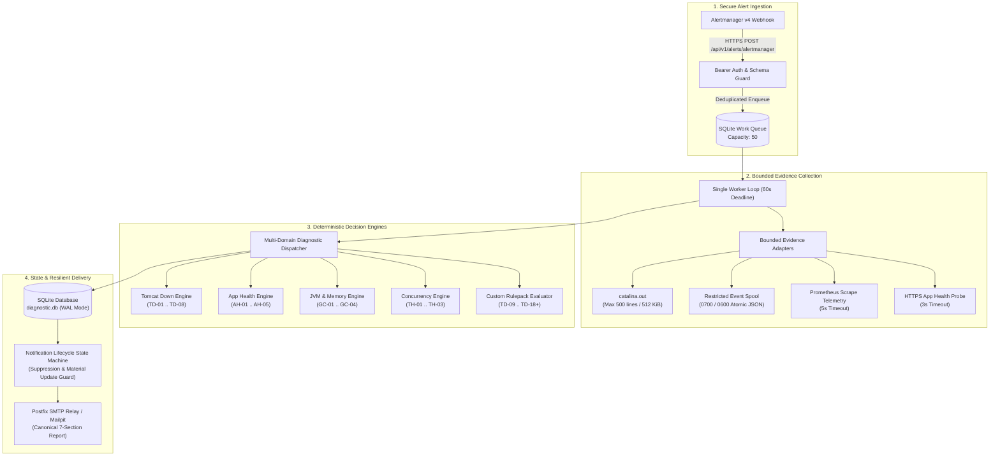

# Tomcat Diagnostic Service — Autonomous Diagnostic Engine & Decision Authority

[](https://nodejs.org)
[](README.md)
[](LICENSE)

**Tomcat Diagnostic Service** serves as the core **Autonomous Diagnostic Engine and Decision Authority** for the Tomcat Monitoring & Diagnostics platform. It ingests runtime incident and availability alerts from Alertmanager over HTTPS, deterministically correlates multi-source evidence (*catalina.out* logs, crash dumps, container lifecycle spool events, and Prometheus telemetry), evaluates failure patterns against a **Declarative Rulepack Engine**, persists incident states within an embedded SQLite database, and dispatches structured 7-section diagnostic reports with actionable SOP recommendations via SMTP.

The service is engineered under strict principles of **Deterministic Honesty** and **Human-in-the-Loop Governance** — the platform never performs unverified automatic remediation or arbitrary container mutations ([TM-ADR-0014](file:///home/eddywiyatno/git/devops-handbook/docs/adr/tomcat-monitoring/adr-records/TM-ADR-0014.md)).

---

## 🏛️ Architecture & Incident Triage Pipeline



---

## 🚀 Key Capabilities & Design Invariants

1. **Durable Webhook Ingestion:** Ingests Alertmanager v4 webhooks over TLS, executing atomic event deduplication into a persistent SQLite queue with a 50-event capacity buffer ([TM-ADR-0015](file:///home/eddywiyatno/git/devops-handbook/docs/adr/tomcat-monitoring/adr-records/TM-ADR-0015.md)).
2. **Target Isolation & Bounded Evidence Gathering:** Enforces normalized target path confinement (anti-path-traversal `../` and symlink validation), bounded log inspection (`catalina.out` capped at 500 lines / 512 KiB with credential redaction), restricted spool reading (capped at 200 files / 16 KiB per record), and bounded Prometheus queries (5s timeout).
3. **Deterministic Multi-Domain Dispatcher:** Implements a modular Strategy Pattern evaluating alerts across **4 Domain Decision Engines** and **20+ Built-in Decision Branches** ([TM-ADR-0023](file:///home/eddywiyatno/git/devops-handbook/docs/adr/tomcat-monitoring/adr-records/TM-ADR-0023.md)):
   - **Tomcat Down (`TD-01` .. `TD-08`):** Scrape failure, Cgroup OOM Killer (exit 137), Fatal JVM Crash (`hs_err`), Port bind conflict, Clean shutdown, Uncorrelated container exit, Probable unresponsive pause, and Undetermined state.
   - **Application Health (`AH-01` .. `AH-05`):** Servlet HTTP 5xx errors, HTTP healthcheck timeout, Health metrics missing, Database connectivity failure, and Upstream dependency failure.
   - **JVM & Garbage Collection (`GC-01` .. `GC-04`):** GC pause duration high (> 1.5s), GC CPU thrashing / overhead (> 85%), Old Gen heap pressure (> 90%), and Metaspace / Class metadata exhaustion.
   - **Concurrency & Threading (`TH-01` .. `TH-03`):** Connector thread pool saturation (100% busy), Thread deadlock detected, and High concurrency queue starvation.
   - **10 Curated Custom Branches (`TD-09` .. `TD-18`):** Database pool exhaustion, Thread pool exhaustion, Heap OOM, Metaspace OOM, SSL Handshake failure, HikariCP timeout, Context init failure, Thread deadlock, Socket read timeout, and SQL query timeout.
4. **Declarative Rulepack Hot-Reloading (`/api/v1/rules`):** Ingests new custom failure rules into SQLite and active memory instantly at runtime without container restarts, protected by a **5-Layer Defense-in-Depth** (Bearer Auth, Schema Guard, Collision Guard, Payload Size Guard, and Append-Only Immutability Guard).
5. **Two-Tier Storage Architecture:**
   - *Tier 1 (High-I/O Engine Named Volumes):* Persistent SQLite database on `diagnostic_data` and read-only Tomcat logs on `tomcat_logs`.
   - *Tier 2 (Host Workspace `tm-home`):* Configurations (`application.json`, `targets.json`), secrets (`bearer-token`), TLS certificates (`server.crt`, `server.key`), and the Restricted Collector Spool (`spool/`).
6. **Resilient Notification Delivery & Lifecycle Orchestration:** Single worker loop with 60s processing deadline, bounded exponential backoff retries (1s and 5s, max 3 attempts), identical-result alert suppression, material update guards (max 1 update per incident), and resolved state correlation ([TM-ADR-0016](file:///home/eddywiyatno/git/devops-handbook/docs/adr/tomcat-monitoring/adr-records/TM-ADR-0016.md)).
7. **Embedded SQLite State Engine:** Forward-only migrations (`001` .. `007`), automated Stale Lock Recovery (restoring interrupted in-flight queue items post-restart), bounded crash loop prevention, and Foreign-Key Safe Retention Pruning with Incremental Vacuuming ([TM-ADR-0013](file:///home/eddywiyatno/git/devops-handbook/docs/adr/tomcat-monitoring/adr-records/TM-ADR-0013.md)).

---

## 📑 Failure Domain Taxonomy (8 Standard Domains)

The diagnostic engine categorizes all failures into **8 Formal Failure Domains** on JSON schemas, SQLite records, and incident reports to streamline SRE escalation routing:

| Failure Domain (`category`) | Scope & Failure Definition | Typical Patterns & Error Signatures | Target Escalation Team |
| :--- | :--- | :--- | :--- |
| **`jvm_memory`** | JVM internal memory allocation, class metadata, or GC thrashing. | `OutOfMemoryError: Java heap space`, `Metaspace`, `GC overhead limit exceeded`, `Direct buffer memory`. | Backend / Java Engineering |
| **`concurrency_threading`** | Worker thread pool saturation, executor starvation, or JVM deadlocks. | `RejectedExecutionException: Thread pool is exhausted`, `Java-level deadlock`, thread starvation. | Backend / Platform Engineering |
| **`database_persistence`** | Connection pool exhaustion, backend DB timeout, or SQL deadlocks. | `CannotGetJdbcConnectionException`, `HikariPool timeout`, `SQLTimeoutException`, connection leak. | Database Administrator / DBA |
| **`network_integration`** | TLS/SSL handshake failures, upstream microservice timeouts, DNS/socket issues. | `SSLHandshakeException`, `SocketTimeoutException: Read timed out`, `ConnectException: Connection refused`. | Network / Cloud Infrastructure |
| **`application_lifecycle`** | Application startup failure, WAR deployment error, servlet context failure. | `LifecycleException: Failed to start component`, `BeanCreationException`, `ClassNotFoundException`. | Application Development Team |
| **`storage_os_limits`** | Host OS resource constraints, file descriptor exhaustion (`ulimit`), disk full. | `Too many open files`, `No space left on device`, `Read-only file system`, exit code without dump. | Systems / Infrastructure Team |
| **`security_session`** | Authentication/authorization failure, token expiry, session replication crash. | `LDAPException`, `SessionReplicationException`, `InvalidTokenException`, CORS filter crash. | Security / IAM & Middleware |
| **`general`** | Cross-domain anomalies, conflicting telemetry, or unclassified fallback states. | `Contradicting state`, `Undetermined evidence`, new failure patterns requiring rule authoring. | SRE / Incident Commander |

---

## 📊 Canonical 7-Section Diagnostic Incident Report

Incident reports are generated and dispatched as structured multi-part HTML and plain-text emails containing seven canonical sections:

1. **Section 1: Incident Header & Target Context** — Incident ID, exact Prometheus alert name (*Rule ID Fidelity*), dynamic severity (`[WARNING]` / `[CRITICAL]`), target instance (`environment`, `host`, `tomcat_instance`), status (`FIRING` / `RESOLVED`), and timestamps.
2. **Section 2: Primary Root Cause & Decision Branch** — Deterministic decision branch classification (`TD-xx`, `AH-xx`, `GC-xx`, `TH-xx`, or custom rulepack) with an executive summary of the root cause.
3. **Section 3: Failure Domain Classification** — Formal failure domain category (`jvm_memory`, `database_persistence`, etc.) for immediate escalation routing.
4. **Section 4: Diagnostic Confidence Score & Evaluation Matrix** — Quantitative confidence assessment (`HIGH`, `MEDIUM`, `LOW`) based on supporting evidence completeness.
5. **Section 5: Correlated Evidence Summary** — Multi-source correlated evidence:
   - Sanitized log snippets from `catalina.out` (with passwords/tokens redacted).
   - Container lifecycle state snapshots and OOM indicators from Restricted Spool.
   - Prometheus scrape telemetry and HTTP application health probe responses.
6. **Section 6: Actionable Operator SOP Steps** — Explicit, manual remediation instructions (*runbook SOP*) for on-call SREs (*Zero Automatic Remediation*).
7. **Section 7: System Metadata & Verification Audit Trail** — SQLite event IDs, trace fingerprints, diagnostic engine version, and rulepack checksums.

---

## 🌐 Consolidated REST API Reference

The Diagnostic Service exposes an internal TLS HTTPS interface on Port 8443:

| Method | Endpoint | Auth | Request / Response | Size Limit | Description & Status Codes |
| :---: | :--- | :---: | :---: | :---: | :--- |
| `GET` | `/health/live` | Public | `-` / `application/json` | - | **Liveness Probe:** Verifies Node.js process health (`200 {"status":"UP"}`). |
| `GET` | `/health/ready` | Public | `-` / `application/json` | - | **Readiness Probe:** Verifies SQLite connectivity and worker loop readiness (`200 OK` / `503`). |
| `GET` | `/health` | Public | `-` / `text/plain` | - | **Self-Monitoring Scrape:** Prometheus text format metrics (`up{job="tomcat-diagnostic-service"}`). |
| `GET` | `/metrics` | Public | `-` / `text/plain` | - | **Operational Metrics:** Exposes internal runtime telemetry (`diagnostic_db_size_bytes`, stale locks, etc.). |
| `POST` | `/api/v1/alerts/alertmanager` | Bearer Token | `application/json` / `application/json` | 256 KiB | **Alert Webhook Ingestion:** Ingests Alertmanager v4 payloads, deduplicates, and enqueues (`202 Accepted` / `400` / `401` / `413` / `429`). |
| `GET` | `/api/v1/rules` | Bearer Token | `-` / `application/json` | - | **Rules Catalog Export:** Exports all active diagnostic rules. Supports query filter `?category=<enum>` (`200 OK` / `401`). |
| `POST` | `/api/v1/rules` | Bearer Token | `application/json` / `application/json` | 64 KiB | **Declarative Rule Ingestion:** Registers a new rule into SQLite and triggers instant hot-reloading (`201 Created` / `400` / `401` / `409` / `413`). |
| `GET` | `/api/v1/rules/:id` | Bearer Token | `-` / `application/json` | - | **Single Rule Inspection:** Retrieves rule details by branch name or database ID (`200 OK` / `404`). |
| `PUT`, `DELETE` | `/api/v1/rules/*` | - | - | - | **Immutability Guard:** Mutating or deleting active rules is strictly forbidden (`405 Method Not Allowed`). |

---

## ⚙️ Configuration Contracts & Runtime Parameters

### Baseline Metadata (`CONFIG`)

```bash
# Application toolchain (TM-ADR-0013)
NODE_VERSION=24.18.0
MODULE_TYPE=module

# Immutable application and base image identities
IMAGE_NAME=localhost/tomcat-diagnostic-service
BASE_IMAGE=localhost/nodejs@sha256:76b1444d507be3398f3196f37bd20f7a97a703871ed2716fa91a1a9520fc482d

# Persistent storage named volumes
DATA_VOLUME=diagnostic_data
LOG_VOLUME=tomcat_logs
```

### Application Parameters (`application.json`)

| Parameter | Type | Default | Description |
| :--- | :---: | :---: | :--- |
| `schemaVersion` | `integer` | `1` | Configuration schema version |
| `listen.host` | `string` | `0.0.0.0` | HTTPS listener bind address |
| `listen.port` | `integer` | `8443` | HTTPS listener port |
| `databasePath` | `string` | `/var/lib/tomcat-diagnostic/diagnostic.db` | Persistent SQLite database file path |
| `tls.certificateFile` | `string` | `/run/tomcat-diagnostic/tls/server.crt` | Server TLS certificate file path |
| `tls.privateKeyFile` | `string` | `/run/tomcat-diagnostic/tls/server.key` | Server TLS private key file path |
| `bearerTokenFile` | `string` | `/run/tomcat-diagnostic/secrets/bearer-token` | Bearer authentication secret file path |
| `targetAllowlistFile` | `string` | `/run/tomcat-diagnostic/config/targets.json` | Allowed diagnostic target registry path |
| `smtp.host` | `string` | `mailpit` | SMTP relay / Mailpit hostname |
| `smtp.port` | `integer` | `1025` | SMTP port |
| `smtp.secure` | `boolean` | `false` | TLS connection mode for SMTP |
| `queue.capacity` | `integer` | `50` | Maximum SQLite work queue capacity |
| `timeouts.diagnosticMs` | `integer` | `60000` | Maximum incident evaluation timeout (60s) |

---

## 🧪 Validation & Automated Testing

```bash
# 1. Static code, schema, and dependency validation
./scripts/validate.sh

# 2. Run unit test suite (62 comprehensive unit tests)
podman run --rm --userns=keep-id -v $(pwd):/app:Z -w /app localhost/nodejs:24.18.0 npm test

# 3. Build container image and run smoke tests
./scripts/build.sh
./scripts/test-image.sh
```

---

## 📂 Repository Structure

```text
tomcat-diagnostic-service/
├── AGENTS.md                 Governance principles and repository boundaries
├── CONFIG                    Toolchain metadata and default storage volumes
├── CONFIG.example            Enterprise container registry configuration template
├── Containerfile             Digest-pinned OCI container definition
├── LICENSE                   Intellectual property and proprietary license
├── PROJECT                   Script-readable project identifier
├── README.md                 Technical specification and architecture guide
├── VERSION                   Semantic version release
├── package.json              ESM package contract and exact-pinned dependencies
├── config/schemas/           JSON Schema contracts:
│   ├── alertmanager-webhook-v4.schema.json
│   ├── application-config-v1.schema.json
│   └── rulepack-v1.schema.json
├── migrations/               Forward-only SQLite schema migrations (001 .. 007)
├── src/                      Application source code:
│   ├── adapters/             SQLite repository, SMTP client, Evidence adapters
│   ├── application/          Diagnostic worker, Result renderer, Notification orchestrator
│   ├── domain/               Multi-Domain Dispatcher, Decision Engines, Rulepack evaluator
│   └── server/               HTTPS server, Bearer auth, Routes, Schema validators
├── test/                     Unit and temporary SQLite integration test suites
└── scripts/
    ├── build.sh              Build versioned and latest container images
    ├── registry-login-helper.sh  Isolated enterprise registry authentication helper
    ├── test-image.sh         Container runtime contract verification
    └── validate.sh           Static validation without network dependencies
```

---

## 👤 Author & Maintainer

- **Lead Engineer & Architect:** Eddy Wiyatno (<edkas07@gmail.com>)
- **Role:** Senior DevOps & Reliability Engineer
- **Project:** Tomcat Monitoring & Diagnostics Platform
